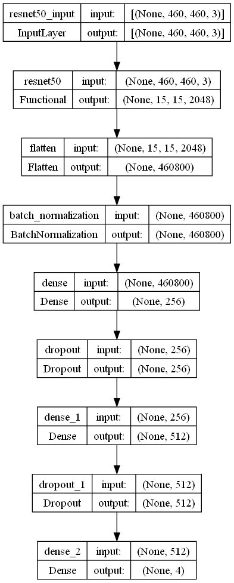
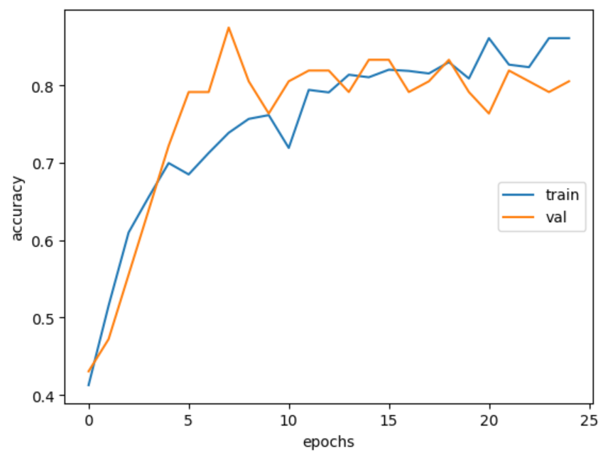

# DeepLung

This repository contains the code for a Lung Cancer Classification System using Deep Learning. The model used to train the data is ResNet50. The dataset used is the [Chest CT-Scan Images dataset](https://www.kaggle.com/datasets/mohamedhanyyy/chest-ctscan-images) from Kaggle.

## Methodology

The model was trained twice. Once using the raw image files, and the second time using the masked images obtained by implementing [smoothing](https://docs.opencv.org/4.x/d4/d13/tutorial_py_filtering.html) and [Roberts Cross Edge Detector](https://homepages.inf.ed.ac.uk/rbf/HIPR2/roberts.htm).

## Model Architecture

The model used is ResNet50. The model was trained for 100 epochs, with early stopping in kicking in at 25, with a batch size of 32. The model was trained on RTX 3080 Ti.

ResNet50 Architecture

## Results

The model trained on the raw images achieved an accuracy of ~0.75, while the model trained on the masked images achieved an accuracy of ~0.85. This is a good improvement over the raw images. The accuracy can be further improved by training the model for more epochs, and by using a larger dataset.

Accuracy and Loss Plot for Masked Images
